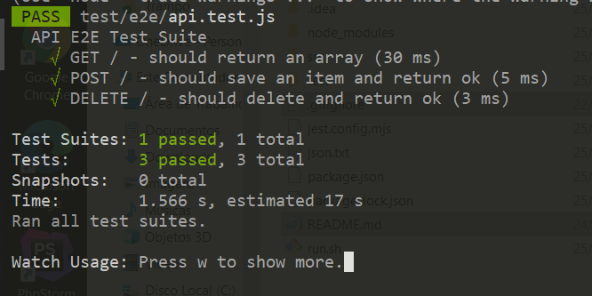

  <a href="#rocket-tecnologias">Tecnologias</a>&nbsp;&nbsp;&nbsp;|&nbsp;&nbsp;&nbsp;
  <a href="#-projeto">Projeto</a>&nbsp;&nbsp;&nbsp;|&nbsp;&nbsp;&nbsp;
  <a href="#-como-rodar">Como rodar</a>&nbsp;&nbsp;&nbsp;|&nbsp;&nbsp;&nbsp;
  <a href="#-como-contribuir">Como contribuir</a>&nbsp;&nbsp;&nbsp;
  

 

## List com database em JSON 

## 🚀 Tecnologias

Esse projeto foi desenvolvido com as seguintes tecnologias:

- [JavaScript](https://developer.mozilla.org/pt-BR/docs/Web/JavaScript) 
- [HTML5](https://developer.mozilla.org/pt-BR/docs/Web/HTML/HTML5) 
- [CSS3](https://developer.mozilla.org/pt-BR/docs/Web/CSS) 
- [NodeJS](https://nodejs.org/en/) - v14.4.0

## 💻 Projeto

O projeto lista os usuários do banco(em JSON) e mostra os detalhes.

  

  

## 🚀 Como Rodar

 - Clone o projeto.
 - Entre na pasta do projeto e rode o comando "npm ci --silent" para instalar as dependências.
 - Rode "nodemon index.js" para iniciar o servidor.
 - Para testar acesse localhost:3000.

## 🤔 Como contribuir

- Faça um fork desse repositório;
- Cria uma branch com a sua feature: `git checkout -b minha-feature`;
- Faça commit das suas alterações: `git commit -m 'feat: Minha nova feature'`;
- Faça push para a sua branch: `git push origin minha-feature`.

Depois que o merge da sua pull request for feito, você pode deletar a sua branch.

## 📝 Licença

Esse projeto está sob a licença MIT.
